## **Climeet 프로젝트**
Climeet(이하 클밋) 프로젝트는 UMC 연합동아리에서 진행한 프로젝트로 클라이머를 위한 여러 기능을 포함하고 있다.

이 게시글을 그 중 암장에서 짧은 주기(대략 2주)로 데이터가 추가되는 루트에 관련한 데이터를 담고있다.

## **무엇을 정리하려는가?**
클밋 어플에서는 암장마다의 루트, 섹터 정보를 저장하고 이 데이터를 운동기록, 커뮤니티, 쇼츠 등 거의 대부분의 기능에 연관하여 직/간접적으로 사용한다. 루트, 섹터 데이터는 쉽게 id로 탐색하는 경우도 많지만, 그와 비슷하게 사용되는 방식이 루트 파인딩 화면에서 암장별로 업데이트 날짜별로, 섹터별로, 난이도별로 필터링해서 루트를 찾는 방식이다.

{:width="300"}

이 화면에서 암장별로 루트를 섹터, 난이도별로 필터링해서 확인할 수 있는데 현재는 버튼을 누를 때마다 서버에서 데이터를 불러오고, 필터링해서 반환하는 방식으로 구성이 되어있다.

따라서 여러 화면에서 계속 사용되는 API이며, 굉장히 자주 호출되기 때문에 조금이라도 시간을 줄일 수 있는 방법이 없을까 생각이 들었다.

또한 현재는 아직 배포하기 전이기도 하고 더미데이터만 넣어두었을 뿐인 단순한 상황이지만, 이후에 추가적으로 기능을 개발하면서 이 과정을 거치고 효율적인 방식으로 데이터 구조를 변경하기에는 지금이 훨씬 편할 것 같았다.

물론 단순한 호기심이기도 하고...

아무튼 그래서 한번 테스트를 해보고자 한다.


## **이것도 부하테스트인가?**
이런 테스트를 진행하려고 계획을 세웠을 때 들었던 궁금증은 "이것도 부하테스트인가?" 였다. 기능에 대해서 일정 수준의 부하를 주고 그 성능을 측정하는 것이기 때문에 그렇다고 생각했는데, 일단 정의를 찾아보았다.

> Wiki
> - Load testing generally refers to the practice of modeling the expected usage of a software program by simulating multiple users accessing the program concurrently.

[위키백과](https://en.wikipedia.org/wiki/Software_load_testing)에 따르면 '동시에 여러 사용자가 프로그램에 접근하는 상황을 가정해서 소프트웨어의 예산 사용량을 모델링하는 것' 이라고 한다. 이 글을 계속 읽어보면 일반적으로 지원해야하는 최대 한도를 기준으로 부하를 걸고 만족할만한 어느정도의 성능이 나오는지 체크하는 과정을 부하테스트라고 정의하고 있다.

예상되는 최대 사용자 수를 기준으로 잡았을 때 정상적인 상황이나, 최대 부하 상황에서 프로그램이 얼마나 동작하는지를 측정하고 파악하는 것이 부하 테스트인 것이다.

이와 비슷한 방식으로 **스트레스 테스트**도 존재하는데 이는 최대로 예상되는 지점을 정해서 부하를 주는 부하테스트 방식과는 반대로, 점점 부하를 늘려가며 이 프로그램의 응답이 어느정도까지 안정적으로 돌아오는지를 측정하는 방식이다.

나는 이 테스트에서는 예상되는 최대 사용자 수를 기준으로 잡고 몇몇 구간에서 각 방식으로 구현된 API가 어느정도의 성능을 내는지를 **부하테스트**를 통해 파악해보려고 한다.

## 테스트 준비
우선 환경을 구성하기 전에, 어느정도의 데이터를 기준으로 얼마나의 부하를 주어야 할지를 정해야 한다.

위에 언급했던 정의에 따르면 부하 테스트는 정상적인 상황이나 최대 부하 상황에서 어느정도의 성능을 보이는지를 측정하는 것이다. 

따라서 정상적인 상황/최대 부하 상황으로 구분하고, 각 상황에서 데이터의 부하/API 호출의 부하로 또 구분하여 측정을 진행하고자 한다.

### **데이터 크기**
이를 명확한 수치로 나타내기 위해서 우선 최대로 예상할 수 있는 데이터의 크기를 계산해보자. 데이터는 루트 파인딩 API에서 사용하는 부분만 고려하게 되면, 
1. 암장의 수:  최대 암장은 전국에 있는 모든 암장이 가입했다면 대략 200개
2. 루트 버전의 수: 한 암장의 과거 루트 세팅까지 있다고 하면 2주에 1번씩 업데이트 된다는 가정 ➔ 1년에 대략 53주(26번 업데이트) ➔ 대략 100개를 기준으로 진행 (약 4년)
3. 섹터의 수: 일반적으로 4개 존재
4. 루트의 수: 한 섹터당 대략 20개

로 생각을 했고, 이 중 루트의 수를 기준으로 1000개 루트(10개 암장), 10000개 루트(100개 암장), 100000개 루트(200개 암장)으로 기준을 잡고 테스트를 진행하였다.

호출 횟수에 따른 부하는 모든 세팅이 끝난 이후에 고민하도록 하고 일단 환경 세팅부터 해보자.

### **환경 세팅**
부하 테스트를 진행하는 환경은 물론 실제 배포 서버와 같은 환경에서 진행하는 것이 가장 좋은 방식이라고 생각한다. 

하지만 현재는 프리티어로 서버를 구성해서 진행하고 있기 때문에 부하 테스트에 많은 제약이 존재할 것이다. 더군다나 현재 이 테스트를 진행하는 목적인 "어떤 방식이 더 빠르게 응답할 것인가?"을 확인하기 위해선 일정 이상의 트래픽을 발생시킬 필요가 있기에 실제 배포 서버에서 진행하기엔 무리가 있다고 생각한다.

따라서 실제 배포서버에서 진행하는대신 로컬에서 진행을 하고 대신 비교할 API를 모두 구현한 뒤에 동시에 부하를 주어 비교를 하는 방식으로 성능을 비교하고자 한다.

뭐... 이렇게 API의 환경을 통일해서 동일한 리소스에서 동시에 실행하게 된다면 정확하게 비교할 수 있지 않을까?

그래서 테스트를 진행하는 환경은 다음과 같다.
- Local Spring 서버
- Local Mysql Container
이며, 테스트를 진행하는 개수에 따라 컨테이너를 따로 두었다.
{:width="300"}

위의 이미지처럼 컨테이너가 존재하고, mysql_load_testing이 루트가 1000개인 컨테이너이다. (이름 규칙을 지은 뒤에 만들었어야했는데, 실수로 저렇게 지어버렸다...)
그리고 루트 개수에 따라 mysql-load-10000, mysql-load-100000으로 따로 존재하게 된다. (지금 보니 mysel로 되어있네..)

이렇게 구성하게 된다면, 같은 포트를 사용할 때 컨테이너만 바꿔주면 Spring 서버에서 다른 변경 없이 데이터의 개수가 다른 환경에서의 테스트를 진행할 수 있게 된다.

### **API 구성**
비교하려는 방식은 총 3가지이다.
1. 문자열로 루트, 섹터를 나눠서 저장하고 사용할 때 문자열을 변환해서 사용
``` java
@Builder
@Getter
@AllArgsConstructor
@NoArgsConstructor(access = AccessLevel.PROTECTED)
@Entity
public class RouteVersionA extends BaseTimeEntity {

    @Id
    @GeneratedValue(strategy = GenerationType.IDENTITY)
    private Long id;

    @ManyToOne(fetch = FetchType.LAZY)
    private ClimbingGym climbingGym;

    @NotNull
    private LocalDate timePoint;

    @NotNull
    @Convert(converter = RouteVersionAConverter.class)
    private List<Long> routeList;

    @NotNull
    @Convert(converter = RouteVersionAConverter.class)
    private List<Long> sectorList;
}
```

2. Json으로 DB에 저장하고, Map<String, List> 으로 데이터를 불러오는 방법
``` java
@Builder
@Getter
@AllArgsConstructor
@NoArgsConstructor(access = AccessLevel.PROTECTED)
@Entity
public class RouteVersionB extends BaseTimeEntity {

    @Id
    @GeneratedValue(strategy = GenerationType.IDENTITY)
    private Long id;

    @ManyToOne(fetch = FetchType.LAZY)
    private ClimbingGym climbingGym;

    @NotNull
    private LocalDate timePoint;

    @Type(JsonType.class)
    @Column(columnDefinition = "json")
    private Map<String, List<Long>> jsonData;
}
```

3. 관계형 테이블을 만들어서 루트와 섹터 각각 하나씩 연관시키는 방법
``` java
@Builder
@Getter
@AllArgsConstructor
@NoArgsConstructor(access = AccessLevel.PROTECTED)
@Entity
public class RouteVersionC {

    @Id
    @GeneratedValue(strategy = GenerationType.IDENTITY)
    private Long id;

    @ManyToOne(fetch = FetchType.LAZY)
    private Route route;

    @ManyToOne(fetch = FetchType.LAZY)
    private Sector sector;

    @ManyToOne(fetch = FetchType.LAZY)
    private SettingDate settingDate;
}
```

개발을 시작했을 때에는 1번 방식으로 기능을 구현하였다.

그 이유는 
1. 초기에는 RouteVersion에서 데이터를 가져올 때 전체를 가져오는 일이 대부분일 것이라고 생각했으며, JSON 자료형으로 Mysql에 접근하게 되면, 접근할 때마다 JSON parsing을 Full Parsing을 한다고 알았기 때문에 MySQL에서 파싱하는 것보다 Spring 서버에서 파싱하는게 더 빠르지 않을까? 하는 생각이었다. 

2. 관계 테이블로 데이터를 구성하기에는 특정 암장에서 한 섹터만 업데이트 된다고 하더라도 최소 20개의 루트정보를 입력해주어야하는데 이 경우 추가되는 루트 개수만큼 컬럼을 추가해줘야하기 때문에, 시간이 지날수록 루트 데이터 컬럼의 수가 엄청나게 많아질 것이라고 생각했다. 1번, 2번 방식은 루트 버전당 1개의 컬럼이 생성되는 반면에, 3번 방식은 루트 버전당 20~40개의 컬럼이 새롭게 생성되기 때문에 이 차이가 클 것이라고 생각했다.

하지만 과연 1번이 가장 나은 방법일까? 라는 의문이 들었고, 응답시간이 꽤나 중요한 테이블이기 때문에 연습도 해볼겸 부하 테스트를 통해서 성능을 알아보고자 한다.

### **더미 데이터 준비**
더미데이터 준비는 원래 [Mokaroo](https://www.mockaroo.com)를 사용하려고 했다. 더미데이터를 쉽고, 유연하게 생성할 수 있다고 하길래 기왕 만들어보는거 써보기로 했다.
하지만... Mokaroo는 무료버전이 최대 1000개의 row만 만들 수 있다는 것을 Gym, Sector 데이터를 모두 만들고, Route 데이터를 만들 때 깨달았다.

{:width="400"}


그래서 필요한 데이터가 최소 1000개인 이번 테스트에서는 Gym과 Sector 데이터를 만들고 끝나게 되었다. ㅋㅋㅋㅋㅋ 이제 이 Route 데이터를 만들기 위해서 다른 방식을 찾아야한다.
1. 우선 Excel을 쓰는 방법이 있다. 이 방법은 각 행과 열을 쉽게 시각적으로 확인이 가능하고, 특정 행, 열의 값을 바로바로 바꿀 수 있다는 이점이 있다. 또한 데이터를 생성할 때 매크로를 사용한다면 VBA를 사용해서 만들어야하긴 하지만 나름 자동화가 된다는 특징이 있다.
2. 다음으로 Python으로도 만들 수 있겠다는 생각을 했다. numpy를 사용하면 여러 연산이 빠르게 처리되기도 하고, 행렬을 표현할 수 있기 때문에 데이터를 쉽게 뽑아낼 수 있다. 또한 Flask와 알고리즘 문제풀이로 다져진 파이썬 문법 실력을 통해 빠르게 구현이 가능할지도 모른다는 이점이 있다.

이 두가지 중 어떤 방법으로 할지 고민을 잠깐 했다가 결국 엑셀로 만들기로 했다. 부하 테스트의 정확성을 높이는 요인 중 동일한 환경에서의 테스트가 가장 중요하다고 생각했는데 이런 동일한 환경 중에는 같은 데이터셋을 통해 테스트를 진행해야한다고 생각했다. 이 점을 위해서 동일한 데이터셋인지를 시각적으로 쉽게 파악이 가능하고, 기존의 데이터를 가공해서 다른 형태로 만드는 것은 엑셀의 함수 기능이 더 빠르게 구현 가능할 것이라고 생각했다. 파이썬으로도 모든게 가능하겠지만 행렬을 자유롭게 다룰정도로 numpy에 익숙하지는 않다는 점과, 시각적으로 계속 확인하기에는 엑셀이 더 편하지 않을까 하는 생각으로 고르게 되었다.

결론적으로 다 만들어 본 뒤에는 엑셀의 VBA는 뭔가 애매하게 불편하긴 한데, 그래도 파이썬으로 하는것보다는 잘 된거같기도 하고... 그냥 어떤 방법으로 하든 비슷한 느낌을 느꼈을 것 같다. 이 과정이 시간이 정말 많이 걸렸는데, VBA를 GPT에게 짜달라고 하고 이를 실제로 사용하기 위한 코드로 변경하는게 시간이 오래걸렸다. (모든 암장에 대해 루트 개수별로 루트버전 데이터를 만들어야하고, 만들어진 데이터를 각 테이블의 속성에 맞게 가공하는 과정이니... 당연히 오래 걸릴 수밖에...) 이후에는 동일한 과정이라 금방금방 했지만 또 100000개의 루트 데이터를 생성하고, 이 루트 데이터로 루트버전을 만드는 과정에서 매크로 돌리는 시간만 1시간이 걸리기도 해서... 참 힘든 과정이였다.

{:width="200"}

더미데이터가 들어있는 파일 크기만 거의 70메가에 이른다.

{:width="500"}

위의 이미지는 매크로 코드의 일부다. 코드 길이는 다 합쳤을 때 저거의 한 5배는 나온것 같다. (대충 힘들었다는 뜻...)

이제 이렇게 모든 코드를 모두 csv로 변환해서 Mysql에 넣어주면 된다.

### **호출 횟수**
이제 모든 데이터의 준비가 끝났으니 어느정도의 부하 환경에서 테스트를 진행할건지 생각해야한다.

사실 어느정도의 사용자가 있을지 잘 예상이 가진 않지만... 그래도 생각해본다면, 요즘 한창 클라이밍 열풍이고 직장인 퇴근시간만 되면 클라이밍장에 사람들이 엄청나게 붐빈다는 이야기를 많이 들었다. 그런 사람들이 모두 이 어플을 사용한다고 생각하면, 대략 1시간에 5000명정도의 사용자가 쓴다고 할 수 있지 않을까?

하지만 그건 로컬에서 하기엔 내 노트북이 버티질 못할 것 같다...
대략 초당 약 100명의 사용자로 한번 해보자. (위에 고민했던건 쓸모가 없어졌다.)

사실 왜 100명으로 했냐면, 부하 테스트를 Postman으로 가볍게 진행했는데 Postman에서는 최대 사용자가 100명이다. 다른 도구를 써볼까도 생각했지만, 일단 내 주변에서 접하기 쉬운것부터 써보자는 생각이 들어서 이번에는 이걸로 진행하고자 했다.

### **호출 시간**
호출 시간에 관련하여 따로 명확한 자료를 찾기는 어려웠다. 그냥 적당히 각 테스트당 10분씩 하면 평균적인 시간을 측정하기에는 괜찮지 않을까? 100 Unit으로 10분씩 하게되면 그래도 1만개의 Request가 3개의 API에 분산되어 들어갈텐데 이정도면 통계학에서 언급하는 [큰 수의 법칙](https://ko.wikipedia.org/wiki/%ED%81%B0_%EC%88%98%EC%9D%98_%EB%B2%95%EC%B9%99)에서도 볼 수 있다시피 충분히 표본집단이 모집단의 값에 거의 가까워지기 때문에 적당한 정도의 테스트라고 생각한다. 

사실 처음 생각했을 때에는 1만개의 Request일 것이라고 생각했지만, 실제로는 해당 값을 훨씬 뛰어넘었다... 더 정확해졌다. 오히려 좋다...

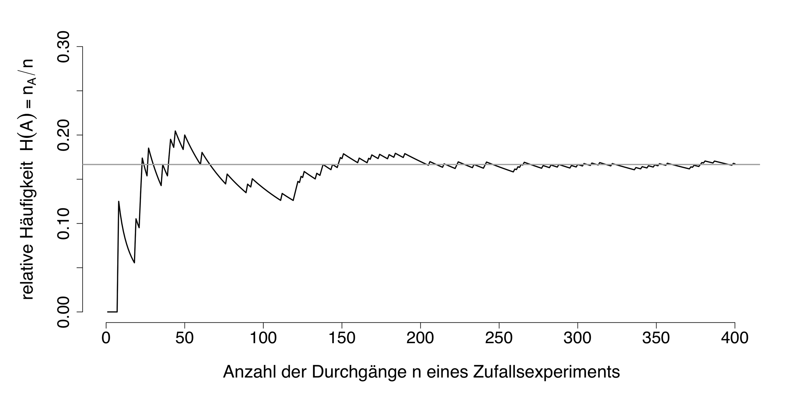

[출처] [위키피디아 큰수의 법칙](https://ko.wikipedia.org/wiki/%ED%81%B0_%EC%88%98%EC%9D%98_%EB%B2%95%EC%B9%99)


### **부하 테스트 도구**
1. nGrinder
2. JMeter
3. Postman

부하 테스트 도구는 이 중 위에서 언급했다시피 Postman으로 진행했다. 그 이유는

1. 다른 설치 없이 이미 가지고 있는 프로그램이라서
2. 가볍게 사용하기에는 이만한 도구가 또 없을 것 같아서
3. 다른 도구에서 제공해주는 여러 기능을 유용하게 사용할 수 있을지 몰라서

이다. 

## **테스트 진행**
테스트를 진행해보았다. Postman으로 진행을 했고, 다음과 같이 각 방식마다 3개의 기능을 구현해놓았지만, 실질적으로 가장 많은 처리가 진행되는 것은 루트 가져오기이기 우선적으로 해당 기능만 체크를 하여 진행했다.

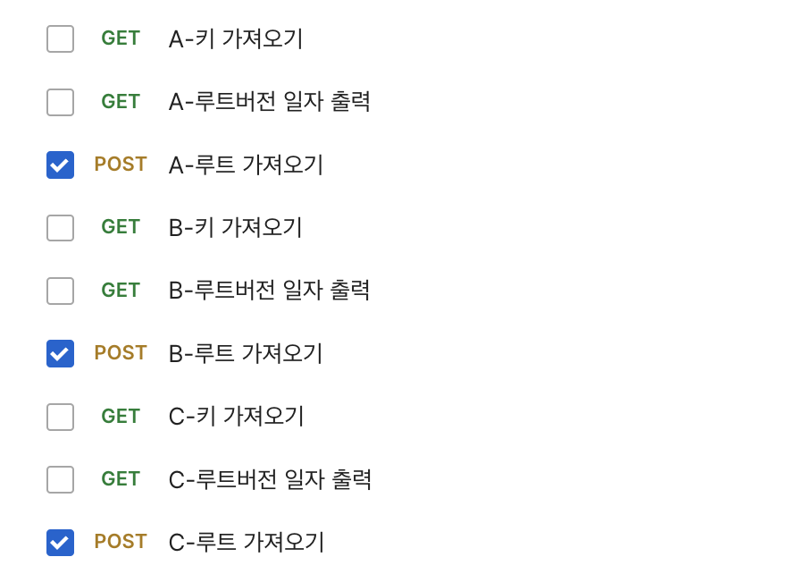{:width="500"}

참고로 루트 가져오기 기능은 GET으로 하는게 일반적이지만 POST방식으로 구현되어있다. 이는 원래 GET으로 구현했다가, 프론트에서 POST로 받는게 나을것 같다는 의견을 주어 반영을 한 것이다. 해당 기능에 Filtering 기능이 존재해서 프론트에서 보내온 값으로 루트를 필터링해 반환해주는데 필터링하는 값이 여러개라 URL 길이도 길어지고 해서... POST가 되었다.

아무튼 이렇게 진행을 해보자.

Postman에서 Performance Test를 해보려고 들어가니 Load Profile에 4가지 방식이 있었다.
- Fixed
  - 고정된 부하를 주어진 시간동안 계속 주는 방식이다.
  - 시스템의 최대 처리 능력과 안정성, 지속성을 파악하는데 유용하다.

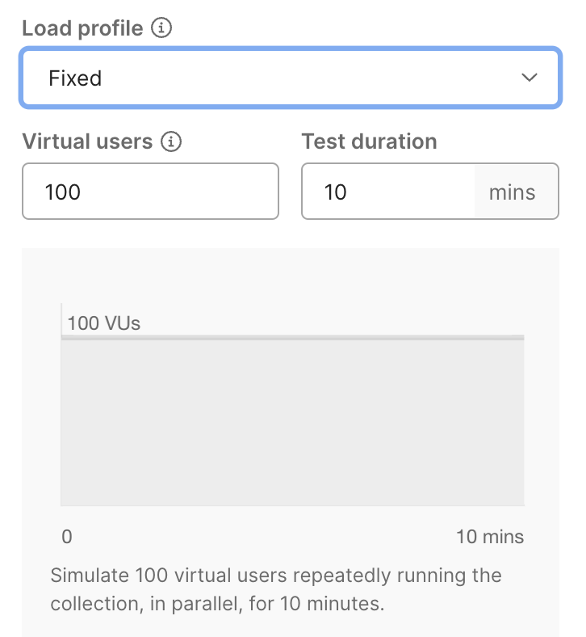{:width="300"}

- Ramp Up
  - 점진적으로 부하를 증가시켜가는 방식이다.
  - 시스템의 확장성, 탄력성, 임계점을 파악하는데 유용하다.

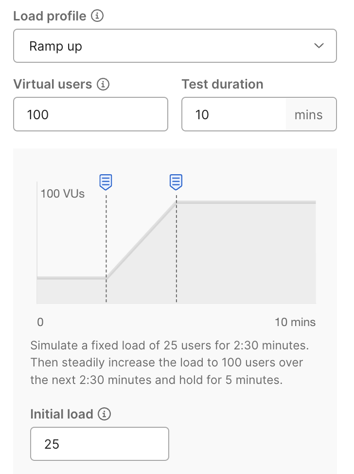{:width="300"}

- Spike
  - 갑작스럽게 높은 부하를 주는 방식이다.
  - 시스템의 내구성, 복구능력을 파악하는데 유용하다.

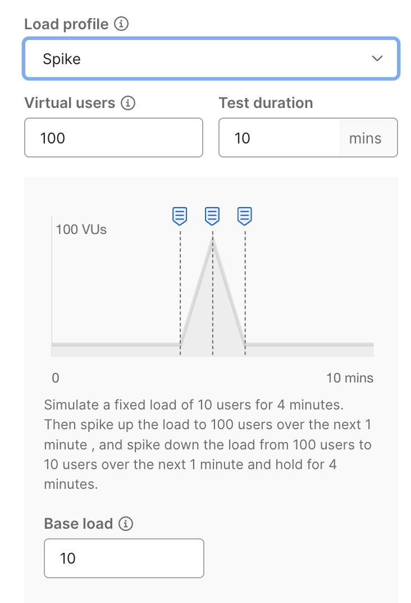{:width="300"}

- Peak
  - 부하를 증가시키다 최대 부하에서 일정시간 테스트하고 다시 감소하는 방식이다.
  - 시스템의 최대 처리능력, 장애 발생 시점을 파악하는데 유용하다.

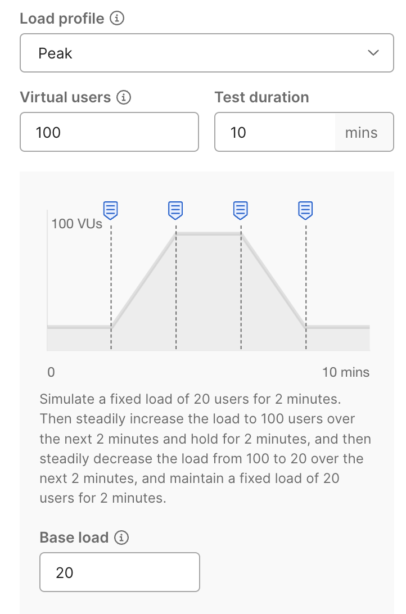{:width="300"}

부하 테스트의 방식은 위의 4가지로 구분될 수 있엇고 이 중 어떤 방식을 사용해야하나 고민을 했지만, 이번 테스트의 목적은 응답속도의 테스트이기 때문에 그냥 대충 Fixed로 10분 계속 돌리도록 하겠다.

경험이니까~ 하는 마음가짐이다.

그리고 테스트를 진행할 때 body에 다음의 값을 집어넣어줘야 한다.

``` json
{
    "gymId": 1,
    "timePoint": "2024-01-28"
}
```
필터링은 공통적으로 스프링에서 진행할 것이기 때문에 다 제외하고 단순히 불러오는 기능만 구현해서 진행한다.

이 body값을 넣어주기 위해서 csv 파일을 또 만들어줘야하는데, 아래처럼 gymId와 timePoint의 모든 경우의 수를 csv로 만들어서 저장해주었다.

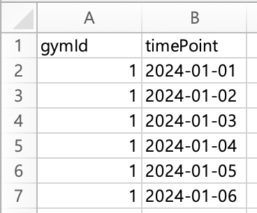{:width="300"}

이제 이 파일을 data file에 넣으면 다음과 같이 인식을 하게된다.

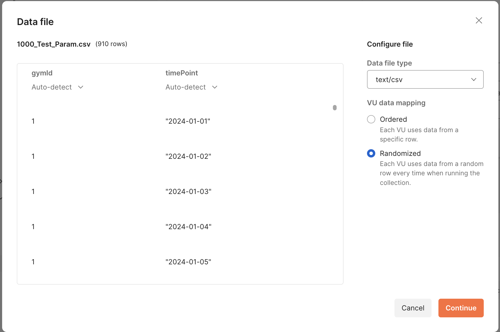

데이터파일을 넣어주고, 인식이 제대로 되었는지 확인을 한 뒤에 VU data mapping에서 Randomized를 선택해서 모든 경우의 수 중에서 랜덤하게 선택하도록 한다. 이런 테스트를 진행할 때 가장 좋은건 랜덤한 input으로 엄청나게 많은 Request를 보내는 것일 것 같기 때문이다.
(느낌적인 느낌...)

그리고 사실 Ordered 방식은 VUser가 각각 1개의 row를 가지고 Request를 보내는 방식이라서 테스트에 제한이 존재하기는 하다. (100명이 최대니 최대 100개의 row로만 테스트를 진행할 수 있었다.)

이제 진짜로 테스트를 진행해보자.

### **1,000개**
1,000개 루트일 때의 테스트이다.

미리 만들어 둔 1,000개 루트 데이터로 구성된 컨테이너와 스프링 서버를 실행시켜주고 부하 테스트를 진행했다.

결과는 다음과 같다.

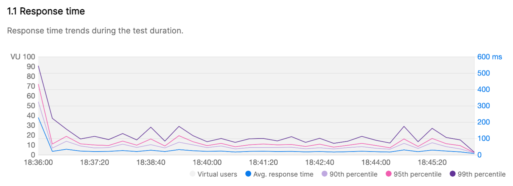

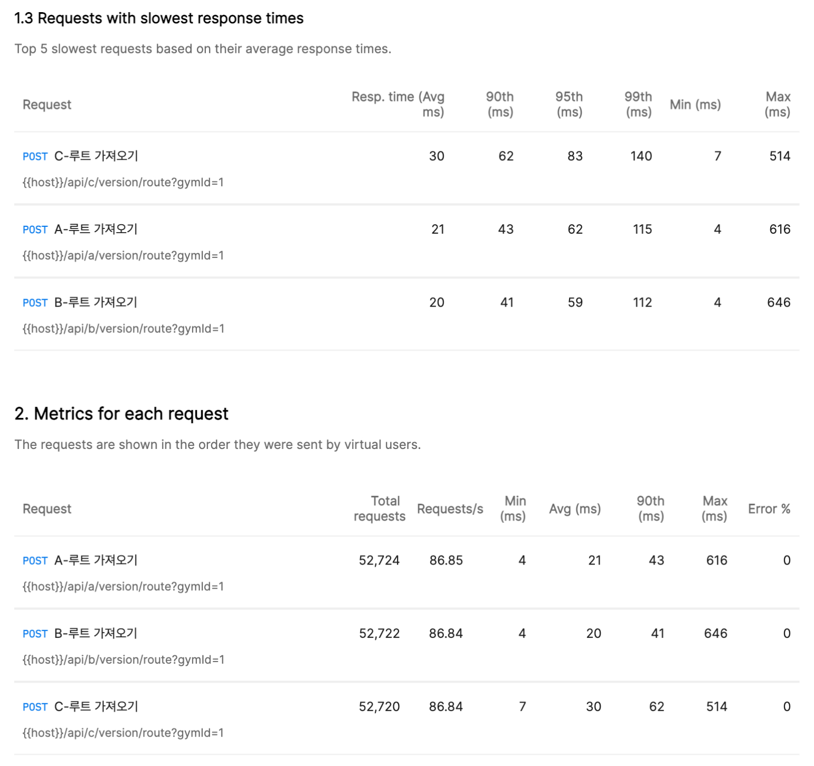

결과를 분석해보면 B < A < C 순으로 응답 속도를 보인 것으로 알 수 있다. 평균적으로는 관계형 테이블(C)로 구성하는 방식이 가장 느렸고 JSON(B)과 문자열(A)로 구성된게 빨랐는데, JSON(B)으로 구성된 방식이 미세하게 더 빨랐다.

약간 흥미로운 사실은 Max Response Time을 보았을 때에는 C < A < B 로 응답 속도가 반환되었다는 것이다.
관계형 테이블(C) 방식이 평균 응답속도에서는 느리지만, 최악 시간으로 보았을 때에는 가장 빨랐다는게 신기했다. 시간의 편차가 작은 방식이 관계형 테이블 방식이라는게 아닐까?


### **10,000개**
이제 10,000개의 루트로 구성된 테이블을 테스트해보자.

바로 결과를 보면

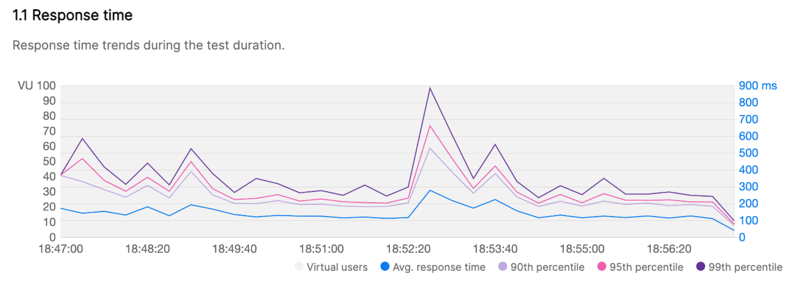

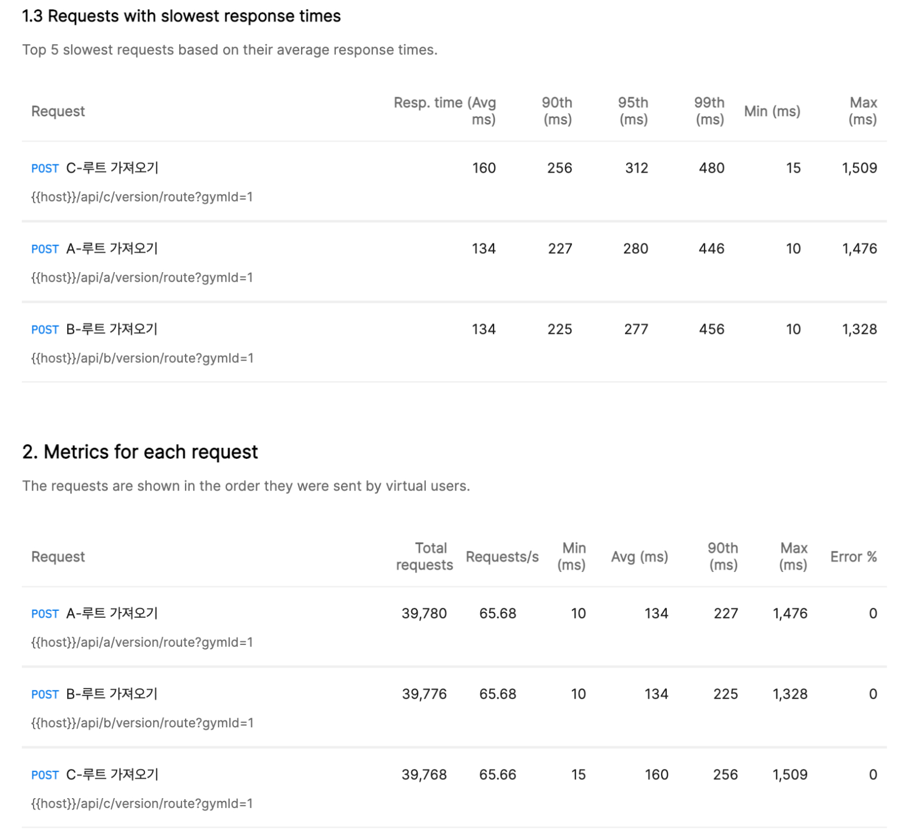

1,000개보다 시간이 현저히 느려졌다. 그리고 1,000개와 마찬가지로 B < A < C 순의 평균 응답 속도를 보였다.

이번에도 Max Response Time을 보면 1,000개로 구성했을때와는 다르게 B < A < C 의 순서를 그대로 따르는 것을 볼 수 있다. 데이터가 많아져서 관계형 테이블(C) 방식으로 데이터를 집어넣을 때 컬럼 수가 약 10만개가 되었기 때문에 이를 순회하는데 시간이 걸린 것으로 예상할 수 있다.

따라서 10,000개의 루트 데이터로 구성된 결과에서는 C는 어떤 방법에서든 느려서 실제 서비스에 적용하기 위한 방식으로는 별로가 아닐까? 하는 생각을 했다.

### **100,000개**

100,000개의 데이터이다. 여기서 약간 테스트를 위한 더미데이터를 잘못 구성한게 아닐까? 하는 생각을 했다. 그 이유는 통계 데이터를 보면 알 수 있다.

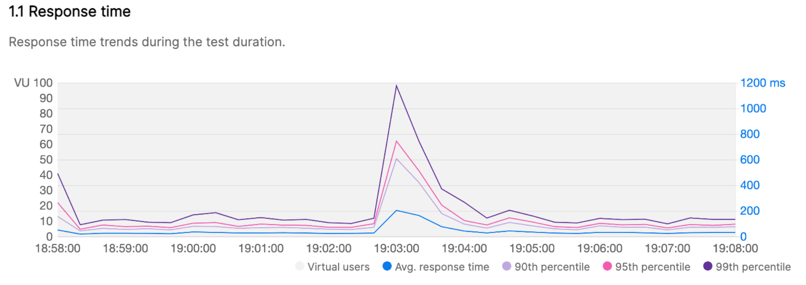

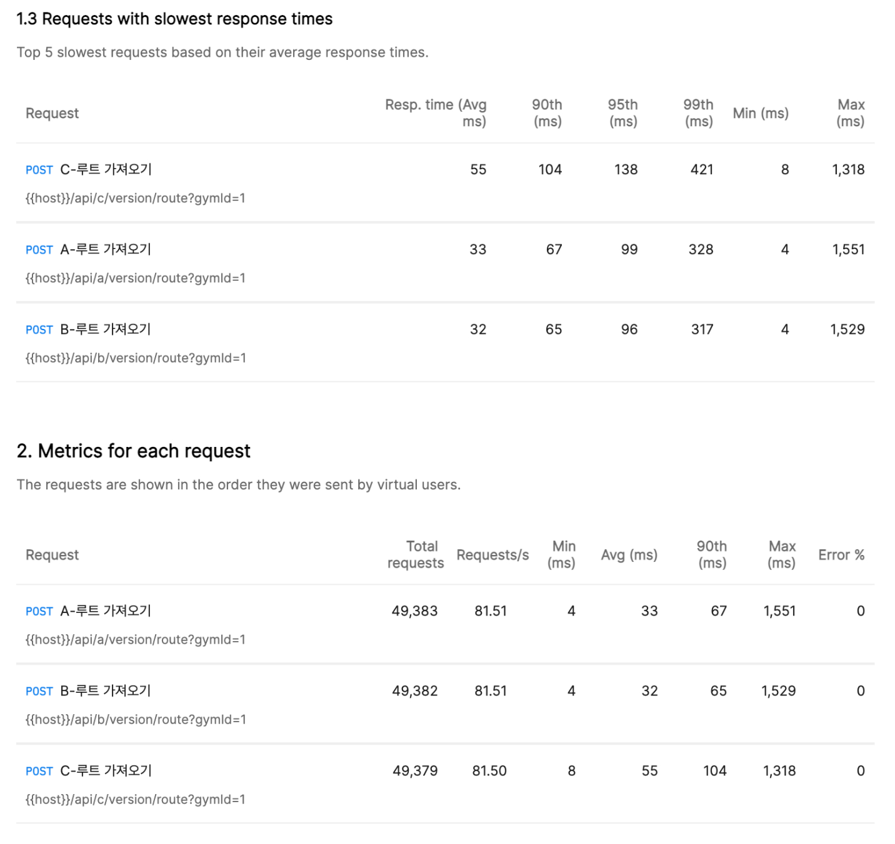

결과는 마찬가지로 B < A < C 가 나왔다... 이건 문제가 안되는데 여기서 이상하다고 느낀 부분은 10,000개의 루트 데이터로 더미데이터를 구성했을 때가 100,000개의 루트 데이터로 구성했을 때보다 속도가 더 오래 걸렸다는 것이다.

분명 동일한 환경에서 실행했고, 동일한 컨테이너고, 데이터의 개수가 100,000개가 더 많은데... 왜 10,000개가 속도가 더 느리지? 하는 생각이 머리를 강타했다.
그래서 우선 데이터의 개수를 확인하면서 제대로 들어갔는지를 확인했다... 문제없다... 100,000개로 구성된 DB가 모든 테이블의 데이터가 최소 2배에서 10배가량 많다... 스프링 서버도 문제없다. 동일한 서버이기 때문에... 그러면 남은 문제점은 더미데이터를 생성했을 때 뭔가 잘못된게 아닐까? 하는건데... 잘 모르겠다... 더미데이터는 쭉 봤을 때 해당되는 루트 범위로 잘 생성되었는데... 도대체 왜? 10,000개가 문제인건지, 100,000개가 문제인건지도 모르겠다...ㅋㅋㅋㅋㅋ 

아...뭔가 잘못되었다는걸 느꼈지만... 일단 그래도 진행하겠다. 어찌되었건 결과가 바뀌지는 않았으니... 이 방식에서도 마찬가지로 JSON(B)으로 구성된 방식이 가장 빨랐고, 관계형 테이블(C)이 가장 느렸다.

## 결론
데이터의 개수를 기준으로 1,000개, 10,000개, 100,000개의 루트 데이터로 구성된 테이블을 각각 생성하고 테스트한 결과 모든 결과에서 JSON으로 구성된 B 방식이 가장 빠른 응답속도를 보였다. 관계형 테이블 방식인 C 방식보다는 유의미한 차이를 보였고, 문자열로 저장된 방식인 A 방식과 비교했을 때에는 큰 차이는 없었지만 그래도 조금 더 빨랐다.

관계형 테이블같은 경우는 컬럼의 수가 다른 방식과 비교했을 때 최소 10배에서 30배까지 차이가 났기 때문에 머릿속으로 생각했을 때에도 느릴 것 같다는 생각을 했다. 

그리고 아마 JSON이 더 빠른 이유는 문자열로 구성된 방식과 실행상에 차이는 없지만, JSON은 DB단에서 직접 파싱을 해서 서버에 제공한다는 점과 문자열은 서버단에서 코드를 작성해서 @Convert 어노테이션으로 적용한 것에서 시간 차이가 발생한 것 같다. @Convert 어노테이션에 오버헤드가 존재하던지 아니면 내가 짠 코드가 시간적인 손실을 발생시키는건지 등 무슨 원인이 있었을 것이다.

### **JSON(B) 방식으로 결정한다.**
따라서 이제 프로젝트에서 구성된 방식을 JSON을 활용한 방식으로 바꾸고자 한다. 그 이유는 다음과 같다.

1. 응답 속도에서 미세하지만 JSON이 더 빠르다.
2. DB단에서 Parsing을 진행하기 때문에 백엔드의 코드 길이를 줄일 수 있다.
3. 추가적인 API를 개발하고 최적화하면서 Query 최적화를 많이 진행하게 될텐데, 이때 JSON으로 구성되어있다면 좀 더 유연한 Query를 만들어낼 수 있을 것이다. (JSON으로 구성되어있다면 내부 Route, Sector 값에 SQL에서 직접 접근할 수 있다.)

## **이번 테스트를 진행하면서**
### **얻은 점**
1. 실제로 부하 테스트를 진행하는 경험을 해보았다. 비록 그것이 제대로 된 테스트는 아닐지라도...
2. 이 테스트를 진행하면서 코드 최적화에 있어서 어떤부분이 더 우선순위일지에 대한 고민을 많이 했다. 부하 테스트를 통한 최적화는 상당히 번거롭고 노동이 많이 포함되는 작업이라는 생각이 들었고, 이러는 것보다 쿼리를 좀 더 효율적으로 짜는게 더 최적화에 도움이 될 것 같았다.
3. 부하테스트와 스트레스 테스트의 차이점에 대해 알게 되었다.
### **아쉬운 점**
1. 10,000개의 데이터와 100,000개의 데이터에서 응답 속도가 서로 뒤바뀐 것 같은 결과를 얻는 점에서 잘 된 부하테스트는 아닌 것 같았다.
2. 어떻게든 끝내자는 마음가짐으로 처음 정한대로 끝까지 진행해보았는데, 루트 개수보다는 루트 버전의 일자를 변화시키는 것이  좀 더 취지에 맞는 테스트가 아닌가 하는 생각이 들었다. 루트 개수와 암장 수에만 차이를 두는것이 아닌 루트 버전도 100개 200개 300개로 두고 해본다면 좀 더 명확한 차이를 느낄 수 있었을 것 같다.
3. 명확한 목적 의식을 가지고 테스트를 진행하기는 했지만, 이 테스트가 정말로 필요한 과정은 아니었던 것 같다. 생각해보면 그냥 '부하테스트를 해보고싶었다' 라는 마음이 '부하테스트가 꼭 필요하다.' 라는 식으로 자신을 가스라이팅한 것 같은 느낌이다.

### **결론**
결론적으로 봤을 때 잘 된 부하테스트는 아니었던 것 같지만, 그래도 부하테스트의 형태는 하고 있는 것 같은 이런 테스트를 해 본 경험에 있어서는 좋았던 경험이었다.

결과를 봤을 때에는 미세하지만 시간적인 효율성이 증가할 것 같기도 하고 말이다.

이렇게 한번 부하테스트를 해보았으니 다음에는 좀 더 공부해서 더 명확한 목표를 위해 테스트를 확실하게 구성하고, 논리적인 판단을 통해 원하는 테스트 결과를 만들어낼 수 있도록 노력해야겠다.

이제 JSON으로 하기로 했으니 이제 구성을 변경하러 가야겠다! 시험기간과 겹쳐서 거의 3주가량 부하테스트만 하고 있었던 것 같은데 오늘 애매하지만 끝낼 수 있어서 다행이다.